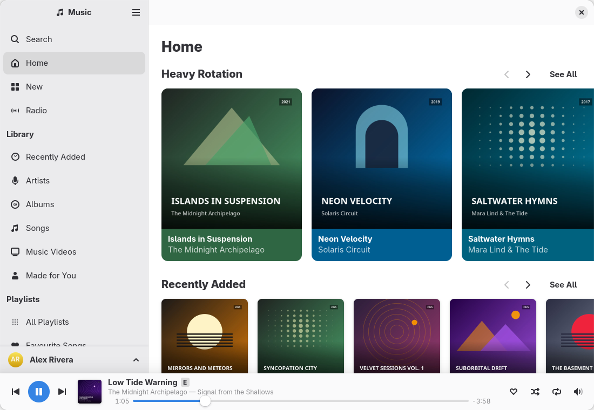

# Apple Music for GNOME

A native GNOME app for Apple Music, built with GTK 4 and libadwaita. The pages
are laid out like Apple's web player: Home, New, Radio and Search, then your
library (Recently Added, Artists, Albums, Songs, Music Videos, Made for You) and
your playlists and playlist folders in the sidebar. Playing music opens a player
bar with a Now Playing view that shows synced lyrics and the queue. It also works
with GNOME's media controls and the keyboard's media keys.



The screenshots show an invented demo library.

**Status:** 0.9.0, the first release candidate.

Not affiliated with Apple. Apple Music is a trademark of Apple Inc.

## How it plays music, and why it needs Google Chrome

Apple Music streams are protected with Widevine DRM, and Apple offers no public
streaming API. WebKitGTK cannot play them, and neither can Chromium, which ships
without Widevine. Google's own Chrome can. So the app starts Google Chrome with
a private profile, shows music.apple.com in it and drives Apple's own player in
that page over Chrome's DevTools protocol, through a private pipe (no network
port). Chrome opens a window once, for you to sign in. After that it runs
headless, with no window, and it stops when the app does.

Because the sound comes from Chrome, your system's per-app volume controls list
it as Chrome.

## Requirements

- An Apple Music subscription.
- **Google Chrome** (`google-chrome-stable`, `google-chrome` or
  `/opt/google/chrome/chrome`; Preferences › Engine › Browser Program can name
  another command). Chromium will not work.
- GTK 4.20 or later, libadwaita 1.9 or later, GLib 2.84 or later, Python 3.12
  or later and PyGObject 3.50 or later. It is developed on Python 3.14.
- To build it: Meson 1.2 or later, gettext and `blueprint-compiler` 0.22. If
  `blueprint-compiler` is not installed, Meson downloads it.

## Install

### From source, with Meson

```bash
git clone https://github.com/Jackicus/GNOME-Apple-Music-App.git
cd GNOME-Apple-Music-App
meson setup _build --prefix=/usr
meson compile -C _build
sudo meson install -C _build --skip-subprojects
```

The install byte-compiles the app's Python modules. `--skip-subprojects` only
matters when Meson had to download `blueprint-compiler`: without it, that
subproject would install a file of its own. To uninstall, run
`sudo ninja -C _build uninstall`, then `sudo rm -r /usr/share/apple-music` to
remove the compiled bytecode as well. (The repository's scripts keep a
development build in `build/`; a system install uses a directory of its own.)

### Arch Linux (once published)

The package `gnome-apple-music` is meant for the AUR; until it is published
there, build it from `build-aux/aur/PKGBUILD` with `makepkg -si`. Google Chrome
comes from the AUR as `google-chrome`:

```bash
yay -S gnome-apple-music google-chrome     # once published; or your AUR helper of choice
```

## First run and signing in

1. Start **Apple Music** from the app grid. On a first run, the sidebar ends
   with a **Sign In** button.
2. Click **Sign In**. A Chrome window opens on music.apple.com. Sign in there
   with your Apple Account, as you would in a browser.
3. Once Apple reports you as signed in, the window closes and Chrome carries on
   headless. The app then syncs your library. A banner shows its progress.

After that, the app starts the engine by itself whenever it starts (if you
turn that off, the first thing you play starts it). While the engine runs, the
library is refreshed when the last refresh is older than the interval chosen in
Preferences (every hour, every 6 hours, the default, every day, or manually);
<kbd>Ctrl</kbd>+<kbd>R</kbd> refreshes it at any time. Closing the window quits
the app and stops Chrome. To keep the music playing with the window closed, turn
on background playback in Preferences (<kbd>Ctrl</kbd>+<kbd>,</kbd>).
<kbd>Ctrl</kbd>+<kbd>?</kbd> lists every keyboard shortcut.

## Known limitations

- Google Chrome is required, and must be the real Chrome: Chromium lacks Widevine.
- Music videos play as audio only: the engine has no window to show them in.
- No offline listening or downloads: the app streams, as the web player does.
- One Apple Account per build: a release install and a development build each
  have their own Chrome profile, cache and sign-in, so each is signed in and
  synced on its own.
- The account's name next to the avatar is read from Apple's web page and may
  stay "Signed In" when the page does not show it.
- Editing playlists is limited to adding songs; creating, renaming and
  reordering playlists happen in Apple's own apps.

## Troubleshooting

- **"Google Chrome is needed to play Apple Music."** No Chrome was found. Install
  Google Chrome, or name its command in Preferences › Engine › Browser Program.
- **"The playback engine stopped."** Chrome exited or its page stopped
  answering. Click **Restart** in the message, or just play something.
- **"Your Apple Music sign-in has expired."** Apple ended the session: click
  **Sign In** on that banner, or **Sign In Again** in the account menu at the
  bottom of the sidebar.
- **Something else.** Run `apple-music --debug` from a terminal and look at what
  it logs (no password or tokens are logged). Preferences › Engine
  shows whether the engine is running; turning off **Run the browser hidden**
  shows Chrome's window at the next start.
- **Starting over.** Sign Out deletes the sign-in and the cache; the commands
  under "Where your data lives" remove everything.

## Privacy

- The app itself talks only to Apple: the music.apple.com page in its Chrome
  (and the Apple services that page uses), and artwork it downloads directly
  from Apple's servers. No telemetry, analytics or crash reports.
- Chrome, as the engine, also talks to Google the way any Chrome does, for
  example to update its components (the Widevine module among them) and for Safe
  Browsing. The app does not turn these off.
- The app never sees your Apple Account password: you sign in on Apple's own
  page, and the session lives in the app's own Chrome profile, apart from your
  everyday browser's.
- The app controls Chrome through a private pipe, with no network port that
  other programs could use. A developer can open a port with the
  `APPLE_MUSIC_DEBUG_PORT` environment variable, but while it is set any program
  on the computer can control the signed-in session: never set it for everyday
  use.

## Where your data lives, and how to remove it

| What | Where |
|---|---|
| The library snapshot, artwork, lyrics and cached pages | `~/.cache/apple-music/` |
| Chrome's profile, which holds your Apple sign-in | `~/.local/share/apple-music/chrome/` |
| Settings | GSettings schema `io.github.jackicus.AppleMusic` |

The development build uses `~/.local/share/apple-music/chrome-devel/` and
`~/.cache/apple-music-devel/` instead, and settings of its own for the account.

- **Sign Out** (in the account menu at the bottom of the sidebar) signs out of
  Apple Music (asking Apple to end the session too), stops Chrome and deletes
  both the Chrome profile and the cache.
- **Preferences › General › Cache › Clear** deletes only the cache.
- To remove everything by hand, quit the app first, then run:

  ```bash
  rm -r ~/.cache/apple-music ~/.local/share/apple-music
  gsettings reset-recursively io.github.jackicus.AppleMusic
  ```

## Development

```bash
scripts/demo.sh         # build the development profile (.Devel ID) into ./build and run it
                        # on an invented library (build/demo): no Chrome, no account
scripts/run.sh          # the same with the real engine (starts Chrome on its own profile)
scripts/run.sh --debug  # with debug logging (or set APPLE_MUSIC_DEBUG=1)
scripts/check.sh        # byte-compile, lint (ruff, if installed), build, unit tests,
                        # and validate the desktop, metainfo and schema files
python3 -m unittest discover -s tests -v    # the unit tests alone
scripts/screenshot.py build/shot.png --demo --page albums [--light] [--size WxH]
scripts/headless.sh COMMAND   # any of these on an invisible display of its own
scripts/am.py status    # drive the engine without the GUI (status, eval, now-playing, events)
```

The development build installs beside a release build, with its own app ID,
Chrome profile, cache and sign-in, and shares the release build's other
settings. `--demo` never starts Chrome. [CONTRIBUTING.md](CONTRIBUTING.md) is
the place to start; `docs/architecture.md` describes the architecture,
`docs/decisions.md` why it is so, and `CLAUDE.md` the conventions.

GNOME Builder can build and run the development profile through the Flatpak
manifest in `build-aux/flatpak/`. That manifest is for development only: from
the sandbox, the app runs the host's Google Chrome through `flatpak-spawn
--host`. Flathub is out of scope, both because the app depends on the host's
Chrome and because the name carries Apple's trademark.

To make a release tarball, run `meson dist -C build`.

## Translating

The strings are in gettext's usual form. To start a translation, say German:

```bash
meson compile -C build apple-music-pot      # the template, apple-music.pot, from the sources
cd po && msginit -l de -i apple-music.pot -o de.po
```

then add `de` to `po/LINGUAS`, translate `de.po` and rebuild; `meson compile -C build
apple-music-update-po` merges new strings into every translation.
Source strings are in British English.

## License

GPL-2.0-or-later. See `LICENSE`.
